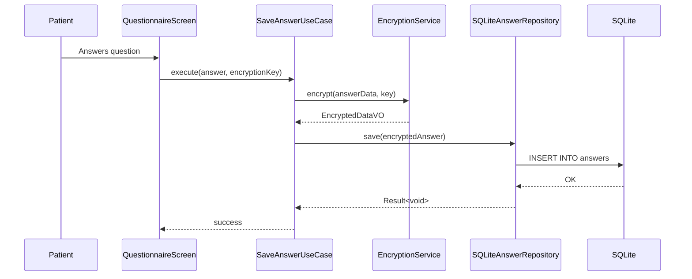

# ARCHITECTURE HANDOFF — Anamnese Mobile App
> **Version**: 2.0 | **Date**: 2025-02-07 | **Classification**: Internal — Engineering

---

## 1. Executive Summary

Anamnese Mobile is a **medical anamnesis digitization platform** built with React Native 0.73, targeting **iOS, Android, Windows (UWP), macOS, and Web**. It enables patients to complete structured medical questionnaires in 19 languages, with all data encrypted at rest using AES-256-GCM (PBKDF2 key derivation, 600K iterations).

The app follows **Clean Architecture** (Domain → Application → Infrastructure → Presentation) with strict separation of concerns, Zod-validated entities, and repository pattern for persistence abstraction.

---

## 2. Architecture Layers

```
┌─────────────────────────────────────────────────────────────┐
│                    PRESENTATION LAYER                       │
│  React Native Screens (24) + Components (25) + Navigation  │
│  State: Zustand + Immer  |  i18n: react-i18next (19 langs) │
│  Theme: ThemeContext + tokens (incl. high-contrast/BITV)   │
├─────────────────────────────────────────────────────────────┤
│                    APPLICATION LAYER                        │
│  Use Cases (8): SaveAnswer, LoadQuestionnaire, CreatePat,  │
│  ExportGDT, Backup, Restore, DeleteAll, ExportAnonymized   │
│  Services: Analytics, PDFTemplate, DocumentRequestMail     │
├─────────────────────────────────────────────────────────────┤
│                   INFRASTRUCTURE LAYER                      │
│  Persistence: SQLite (6 repos) + InMemory (6 repos)        │
│  Encryption: NativeEncryption | WebCrypto (platform switch) │
│  Speech: SystemSpeechService + TTSService                  │
│  OCR: TesseractOCRService (planned)                        │
├─────────────────────────────────────────────────────────────┤
│                      DOMAIN LAYER                           │
│  Entities: Patient, Questionnaire, Answer, Document,       │
│            GDPRConsent, QuestionUniverse, CompartmentQ      │
│  Value Objects: EncryptedData, GDTExport, CompartmentEnc   │
│  Validators: AnswerValidator, PatientValidator              │
│  Factories: QuestionFactory                                 │
│  10 Repository Interfaces (contracts)                       │
└─────────────────────────────────────────────────────────────┘
```

### Dependency Rule
**Inward only**: Presentation → Application → Domain. Infrastructure implements Domain interfaces.
Never: Domain → Infrastructure. Never: Domain → Presentation.

---

## 3. Component Hierarchy

```
<GestureHandlerRootView>
  <SafeAreaProvider>
    <ThemeProvider>
      <ToastProvider>
        <PatientProvider>
          <NavigationContainer>
            <SessionTimeoutGuard>
              <RootNavigator />
            </SessionTimeoutGuard>
          </NavigationContainer>
        </PatientProvider>
      </ToastProvider>
    </ThemeProvider>
  </SafeAreaProvider>
</GestureHandlerRootView>
```

**Startup Sequence**:
1. Import gesture-handler (try/catch for Windows compatibility)
2. Install `devNakedTextGuard` (DEV only)
3. Initialize SQLite database connection
4. Restore active session IDs from encrypted persistence
5. Load persisted encryption key (if user opted in)
6. Mount React tree with provider stack

---

## 4. Navigation Map (25 Routes)

| Route | Screen | Flow |
|-------|--------|------|
| `Home` | HomeScreen | Entry point |
| `SelectLanguage` | SelectLanguageScreen | 19-language selector |
| `MasterPassword` | MasterPasswordScreen | Brute-force protected |
| `RoleSelection` | RoleSelectionScreen | Patient vs. Staff |
| `Privacy` | PrivacyScreen | GDPR Art. 6/7 consent |
| `PatientType` | PatientTypeScreen | New vs. Returning |
| `VisitReason` | VisitReasonScreen | Triage |
| `PatientStatus` | PatientStatusScreen | Status check |
| `DocumentRequest` | DocumentRequestScreen | Document flow |
| `PrescriptionRequest` | PrescriptionRequestScreen | Rx flow |
| `ReferralRequest` | ReferralRequestScreen | Referral flow |
| `SickNoteRequest` | SickNoteRequestScreen | Sick note flow |
| `PatientInfo` | PatientInfoScreen | Demographics |
| `GDPRConsent` | GDPRConsentScreen | Consent capture |
| `Questionnaire` | QuestionnaireScreen | Core anamnesis |
| `Summary` | SummaryScreen | Review answers |
| `Export` | ExportScreen | GDT/PDF export |
| `SavedAnamneses` | SavedAnamnesesScreen | History |
| `Feedback` | FeedbackScreen | User feedback |
| `Voice` | VoiceScreen | Voice input |
| `Calculator` | CalculatorScreen | Clinical calculators |
| `DataManagement` | DataManagementScreen | GDPR Art. 17 |
| `Dashboard` | DashboardScreen | Analytics |
| `FastTrack` | FastTrackScreen | Quick anamnesis |

---

## 5. Data Flow: Questionnaire Lifecycle



---

## 6. Encryption Architecture

| Component | Tech | Purpose |
|-----------|------|---------|
| **Algorithm** | AES-256-GCM | Authenticated encryption |
| **KDF** | PBKDF2-SHA256, 600K iter | Key derivation from master password |
| **Native Runtime** | `react-native-quick-crypto` | Hardware-accelerated on iOS/Android |
| **Web Runtime** | `@noble/ciphers` + `@noble/hashes` | Pure JS fallback |
| **Key Storage** | In-memory (default) | Cleared on app close |
| **Key Persistence** | `react-native-keychain` (opt-in) | iOS/Android only |
| **Windows** | `SharedEncryptionBridge` → `null` | No keychain on Windows |
| **Crypto Shredding** | `DeleteAllDataUseCase` | GDPR Art. 17 compliance |

---

## 7. Windows Integration (UWP)

### 7.1 Native Layer
- **Solution**: `windows/anamnese-mobile.sln`
- **Project**: `windows/anamnese-mobile/anamnese-mobile.vcxproj` (C++/WinRT)
- **Entry**: `App.cpp` → `MainPage.cpp` → JS bundle via Metro
- **Package**: `Package.appxmanifest` (MSIX)

### 7.2 Platform-Specific Behaviors
| File | Adaptation |
|------|------------|
| `RootNavigator.tsx` | Shorter animation durations (140ms/120ms) |
| `MasterPasswordScreen.tsx` | Platform-specific password entry |
| `QuestionnaireScreen.tsx` | Navigation guard, conditional rendering |
| `SharedEncryptionBridge.ts` | Returns `null` (no keychain) |
| `PatientInfoScreen.tsx` | DatePicker fallback |
| `FeedbackScreen.tsx` | UI adaptation |

### 7.3 Disabled Modules on Windows
| Module | Reason |
|--------|--------|
| `react-native-fs` | Security — prevents unintended file system access |
| `react-native-document-picker` | CLRHost.dll not generated |

---

## 8. Testing Simulation Layers

| Layer | Framework | Coverage |
|-------|-----------|----------|
| **Unit Tests** | Jest 29.7 + react-native preset | 68 suites, 521 tests |
| **Component Tests** | @testing-library/react-native | Screen rendering tests |
| **E2E Tests** | Detox 20.14.8 | Setup present, not yet active |
| **Mocked** | NativeModules, SQLite, AsyncStorage, Keychain, Quick-Crypto, TTS, Reanimated |

### Uncoverable Code (by design)
- `NativeEncryptionService`: Requires native PBKDF2 runtime → skipped in Jest (29 pending tests)
- Zustand/Immer integration tests: ESM-only imports → blocked by Jest CJS runner (2 todo tests)

---

## 9. Critical Paths for Handoff

1. **Encryption Key Flow**: `MasterPasswordScreen` → PBKDF2 → key in Zustand store → used by all Save/Load use cases
2. **Session Persistence**: `sessionPersistence.ts` → encrypted snapshot of active IDs → restored on cold start
3. **GDPR Deletion**: `DataManagementScreen` → `DeleteAllDataUseCase` → wipes all repos + destroys key
4. **i18n**: 19 locale JSONs synced by `locales.test.ts` — canonical = `en.json`, all others must have same keys
5. **Windows Build**: MSBuild via `anamnese-mobile.vcxproj` → requires Visual Studio Build Tools 2022 + Windows SDK 10.0.19041

---

## 10. Agent Operational Guide

### Build Commands
```bash
# Dev (debug)
npx react-native run-windows

# Release
npx react-native run-windows --release

# Bundle only (JS)
npx react-native bundle --platform windows --dev false --entry-file index.js --bundle-output windows/anamnese-mobile/Bundle/index.windows.bundle

# Type check
npx tsc --noEmit

# Tests
npx jest --no-coverage --forceExit

# Tests with coverage
npx jest --coverage --forceExit
```

### Key Configuration Files
| File | Purpose |
|------|---------|
| `tsconfig.json` | TS 5.3.3, strict, path aliases (@domain, @application, etc.) |
| `jest.config.js` | RN preset, coverage thresholds 70%, moduleNameMapper |
| `jest.setup.js` | Global mocks for all native modules |
| `metro.config.js` | Metro bundler config |
| `babel.config.js` | Babel with RN preset |
| `webpack.config.js` | Web build config |
| `react-native.config.js` | Platform config, disabled modules |
| `app.json` | App metadata |

---

*Generated by DevOps-Architect v1.0 — Phase 3*
